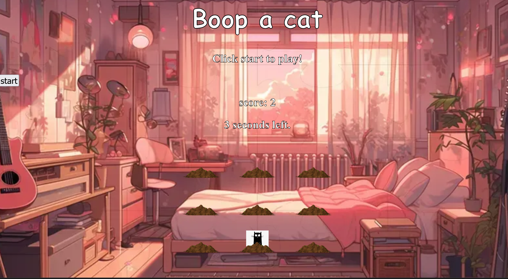
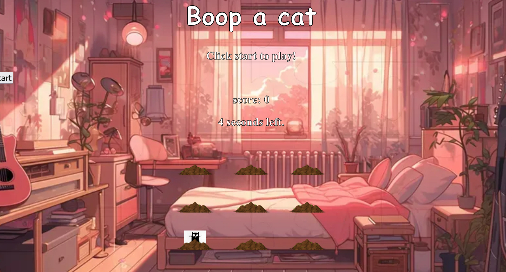
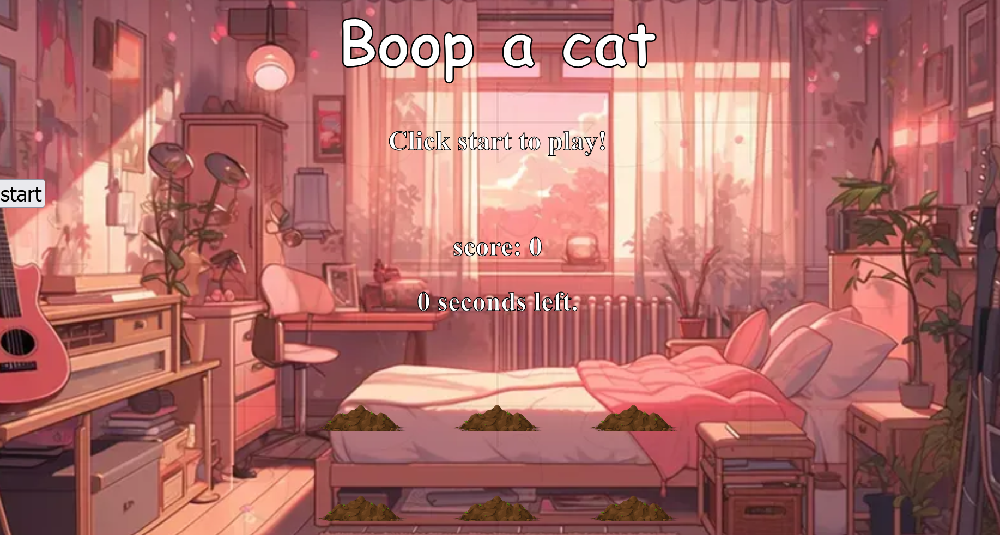

## Capstone project: Boop a Cat

For the capstone project, I chose to work on the Whack-a-Mole project and personalize it into a cat-themed game.

## Project Plan and Reflection

### Plan

My plan was to build a working game with nine holes, cats that appear randomly, a start button, a score display, and a timer. The main functions are `randomInteger()`, `setDelay()`, `chooseHole()`, `toggleVisibility()`, `showAndHide()`, `showUp()`, `gameOver()`, `updateScore()`, `clearScore()`, `updateTimer()`, `startTimer()`, `whack()`, `setEventListeners()`, and `startGame()`.

I used random numbers to choose a hole and to set the delay between appearances. I used `classList.toggle()` to show and hide the cats, `setTimeout()` to control how long a cat is visible, and `setInterval()` to count down the game timer. I updated the score through the DOM with `textContent`.

### Implementation Plan

I started by completing the basic HTML structure, including the title, start button, score, timer, and nine holes. I then implemented the randomness functions and connected them to the game flow. After that, I added the visibility and timing functions, connected click events to each cat, and added the score and timer updates.

For the originality portion, I changed the title to Boop a Cat, used a cozy bedroom background, replaced the mole sprite with a cat image, and added a lofi music track. I kept the existing game structure so the new theme could be added without changing the main game logic.

### Implementation Reflection

### US-01 - Basic game structure
- I added a title for the game. I changed the original Whack-a-Mole theme to Boop a Cat.
- I implemented 9 holes and defined the start button.
- I used query selectors to access the HTML elements in `index.js`.

### US-02 - Basic game functionality: Randomness

1. I defined the random integer function. I used it in the setDelay function when the difficulty is set to hard.

2. I implemented the setDelay function. It controls how fast the cats show up depending on the selected difficulty. I used if statements to process the difficulty parameter and set the game speed.

3. I implemented the chooseHole function using the random integer function to select a number between 0 and 8. This number selects a hole from the holes array.

### US-03 - Game flow

1. I populated the toggleVisibility function by using the `classList.toggle()` JavaScript method with the value 'show'.

2. I implemented the showAndHide function, which uses `setTimeout()` with the provided delay to hide the cat. After that, `gameOver()` is called.

3. I implemented the gameOver function, which uses an if statement to check if the time is greater than 0. If it is, `showUp()` is called again so another cat can be shown with its respective delay until the time runs out.

4. I implemented the startGame function, which runs through a sequence of functions to initialize the game flow: `clearScore()`, `setDuration()`, `setEventListeners()`, `startTimer()`, and `showUp()`.

### US-04: Whack!

1. I used the `+=` operator to increment the score by 1 point and used `score.textContent` to change the text inside the HTML element "score".

2. I used the assignment operator to set the score to 0 in the `clearScore()` function.

3. For the whack event, I passed in the `updateScore()` function to be executed.

4. For the event listener function, I used a forEach function and added the whack event handler to each mole.

### US-05: Timer

1. I set the timer using the `setInterval()` JavaScript method by passing `updateTimer` as the function and 1000 as the interval in milliseconds.

2. I implemented the updateTimer function by using an if statement to check if the time is greater than 0. If true, it subtracts 1 from the value and uses `timerDisplay.textContent` to update the text inside the timer element.

 

### US-06: Originality

1. I changed the theme of this game to Boop a Cat instead of Whack-a-Mole. I used a cozy lofi bedroom background and adjusted the song to match the aesthetic.

2. I changed the moles to cats and used a cat image.

### Coding Trade-offs

I chose to keep the original simple function structure because it made each part of the game easier to understand and test. Using separate functions for the timer, score, visibility, and game flow makes the code more readable, although it means the project has more small functions to manage.

I used local image and audio assets instead of depending on remote files. This makes the project more reliable when it is run locally or deployed. I chose a PNG for the cat so its transparent background allows the bedroom background to show around it.

### Choices, Challenges, and Debugging

One challenge was making sure the correct DOM elements were selected. The score and timer needed `querySelector()` with their IDs so that `textContent` would update the actual HTML elements.

Another issue happened when `showUp()` passed `0` to `showAndHide()` instead of passing a hole element. This caused a `classList` error because the number `0` does not have a `classList` property. I fixed this by using `chooseHole(holes)` in `showUp()`.

I also checked the build when local assets were added. A stale Parcel build produced an incorrect doubled path, but a clean rebuild confirmed that the assets were being bundled correctly. The final test run passed all 32 tests.

### AI Tools Used

- **GitHub Copilot**: Used for guidance with JavaScript functions, DOM methods, CSS asset paths, debugging, and reviewing the documentation. It was also used to help identify why the timer and `classList` errors were occurring.
